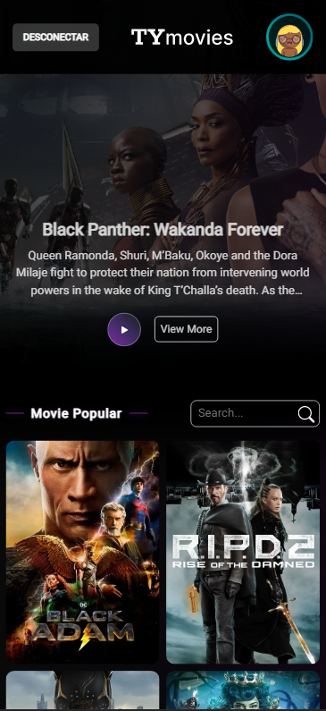

<h1 align=center>

</h1>

<div align="center">

![BADGE_LICENSE] ![BADGE_NPM_VERSION] ![BADGE_WEB_NEXTJS] ![BADGE_SERVER_NODEJS] ![BADGE_TYPESCRIPT] ![BADGE_OPEN_SOURCE]  ![BADGE_STARS] ![BADGE_FORKS]

</div>

<h3 align="center">

🤓 TyMovies is a **Personal** project developed for the purpose of **Study**, a **Movies in theaters** platform using ***TypeScript, Node, React and NextJs*** technologies.

</h3>


## **🚀 OBJECTIVE**

The purpose of the project is to **put my knowledge into practice in order to study** so that **I can practice** and better with good practices and development.

<!-- 
  ...
  Local Reservado para o GIF do projeto rodando.
  ...
-->

## **🎨 LAYOUT**

<div style="display:flex; padding:2rem; flex-wrap: wrap; gap: .5rem; justify-content:center">




</div>

## **💻 TECHNOLOGIES**


#### **Website** ([NextJs][nextjs] + [TypeScript][typescript])

  - **[Styled Icons][Styled_icons]**
  - **[Axios][axios]**
  - **[BigHeads][BigHeads]**
  - **[Firebase][firebase]**
  - **[Nookies][nookies]**
  - **[Swiper][swiper]**
  - **[Babel][babel]**


  \* See the file <kbd>[package.json](./package.json)</kbd>

#### **Utilities**

- API: **[The Moviedb][themoviedb]**  
- Editor: **[Visual Studio Code][vscode]**
- Commit Conventional: **[Commitlint][commitlint]**
- Teste de API: **[Insomnia][insomnia]**
- Ícones: **[Styled Icons][Styled_icons]**
- Fontes: **[Roboto][font_roboto]**


## **🖊 HOW TO USE**

### Initial Settings

First, you need to have <kbd>[NodeJS](https://nodejs.org/en/download/)</kbd> installed on your machine.

If you are using **Linux**, you can choose to install **Node** through the <kbd>[asdf]</kbd> version manager to facilitate the **Node* version change process *, when necessary.

You can also choose to use **yarn** instead of **npm**. You can install by clicking on this <kbd>[link][yarn]</kbd>, or via <kbd>[asdf]</kbd>.

You need to rename the `.env.example` file to `.env` and enter the information that matches your **Firebase** account:

```sh
$ mv .env.example .env
```
Install the dependencies contained in the `package.json` files found at the root of the repository (for commit management). To install the dependencies, just open the terminal in the directory and type the command:

```sh
$ npm install

# ou
$ yarn
```

### Using the Website

```sh
# Executando o website no modo de desenvolvimento:

$ npm run dev
# or
$ yarn dev
```

> Se o browser não abrir automaticamente, acesse: http://localhost:3000.


## **🎉 THANKS**

<div align=center>

<table style="width:100%">
    <td>
      <a href="https://github.com/AfonsoBezerra">
        
      </a>
    </td>
  </tr>
</table>

</div>

## **📜 LICENSE**

This repository is licensed under the **MIT LICENSE**. For more detailed information, read the [LICENSE](./LICENSE) file contained in this repository.

<h3 align="center">
Made by ❤️ por <a href="https://www.linkedin.com/in/afonso-bezerra-33b495174/">Afonso Bezerra</a>
<br><br>
<a href="https://afonsobezerra.com/">
  
</a>
</h3>

<!-- Website Links -->

[rocketseat_site]: https://rocketseat.com.br/

<!-- Badges -->

[BADGE_LICENSE]: https://img.shields.io/github/license/x0n4d0/ecoleta


[BADGE_NPM_VERSION]: https://img.shields.io/badge/npm-6.14.4-red

[BADGE_WEB_NEXTJS]: https://img.shields.io/badge/web-nextjs-blue


[BADGE_SERVER_NODEJS]: https://img.shields.io/badge/server-nodejs-important

[BADGE_STARS]: https://img.shields.io/github/stars/AfonsoBezerra/TyMovies?style=social

[BADGE_FORKS]: https://img.shields.io/github/forks/AfonsoBezerra/TyMovies?style=social

[BADGE_TYPESCRIPT]: https://badges.frapsoft.com/typescript/code/typescript.png?v=101

[BADGE_OPEN_SOURCE]: https://badges.frapsoft.com/os/v1/open-source.png?v=103

<!-- Techs -->

[nextjs]: https://nextjs.org/

[typescript]: https://www.typescriptlang.org/

[node]: https://nodejs.org/en/


[themoviedb]: https://www.themoviedb.org/

[vscode]: https://code.visualstudio.com/

[react_native]: http://www.reactnative.com/

[vscode_sqlite_extension]: https://marketplace.visualstudio.com/items?itemName=alexcvzz.vscode-sqlite

[commitlint]: https://github.com/conventional-changelog/commitlint

[insomnia]: https://insomnia.rest/

[Styled_icons]: https://styled-icons.dev/

[axios]: https://github.com/axios/axios

[BigHeads]: https://bigheads.io/

[firebase]: https://firebase.google.com/?hl=pt

[nookies]: https://github.com/maticzav/nookies

[swiper]: https://swiperjs.com/

[babel]: https://babeljs.io/

[font_roboto]: https://fonts.google.com/specimen/Roboto

[asdf]: https://github.com/asdf-vm/asdf

[yarn]: https://classic.yarnpkg.com/en/docs/install/#debian-stable
